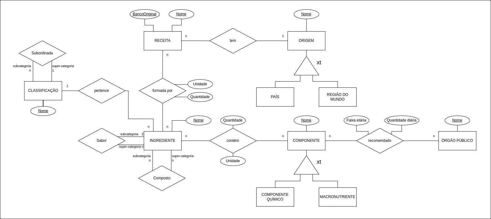

# Projeto 1 - Modelo Conceitual e Lógico

## Slides da Apresentação
[PDF](PROJETO_1.pdf)

## Motivação e Contexto
O objetivo principal desta primeira fase do projeto é elaborar uma modelagem conceitual e lógica de um banco de dados relacional que seja capaz de responder a algumas perguntas interessantes sobre composições químicas e valores nutricionais de alimentos, analisando-os individual e coletivamente (como parte de uma receita alimentar). Além dessas análises, também relacionamos alimentos à regiões e países do mundo, o que possibilita que também façamos observações geopolíticas mais abrangentes. As perguntas que pretendemos responder estão descritas abaixo. Para montarmos o modelo, analisamos 5 bancos de dados diferentes com diversas informações químicas, nutricionais e geográficas sobre alimentos. Pensando em uma integração deles num modelo relacional, fomos capazes de elaborar um modelo geral que conseguisse responder às perguntas levantadas. O modelo conceitual final em entidade-relacionamento (ER), o modelo lógico relacional e os slides de apresentação estão presentes no repositório, e são de livre acesso.

## Bases de Dados
título da base | link | breve descrição
----- | ----- | -----
FooDB | [link](https://foodb.ca/) | Dados sobre alimentos, sua química, seus ingredientes e nutrientes.
Flavor network and the principles of food pairing | [link](https://doi.org/10.1038/srep00196) | Artigo que disponibiliza dados sobre diversos sabores, além de uma lista de receitas por região do mundo.
RecipeNLG | [link](https://recipenlg.cs.put.poznan.pl/) | Receitas e as devidas quantidades dos ingredientes utilizados em cada uma delas.
CulinaryDB | [link](https://cosylab.iiitd.edu.in/culinarydb/) | Dados de receitas e ingredientes associados a 22 regiões do mundo diferentes.
Nutrient Recommendations: Dietary Reference Intakes (DRI) | [link](https://ods.od.nih.gov/HealthInformation/nutrientrecommendations.aspx) | Recomendações diárias de consumo de diversos nutrientes, divididos por faixa etária.

## Modelo Conceitual

## Modelos Lógicos
~~~
ORIGEM(_Nome_, Tipo)

RECEITA(_Nome_, _BancoOriginal_, Origem)
	Origem chave estrangeira -> Origem(Nome)

INGREDIENTE(_Nome_, Classificacao)
	Classificacao chave estrangeira -> Classificacao(Nome)

INGREDIENTECOMPOSTO(_IngredienteComposto_, _IngredienteOriginal_)
	IngredienteComposto chave estrangeira -> Ingrediente(Nome)
	IngredienteOriginal chave estrangeira -> Ingrediente(Nome)

SABOR(_Id_, Ingrediente1, Ingrediente 2)
	Ingrediente1 chave estrangeira -> Ingrediente(Nome)
	Ingrediente2 chave estrangeira -> Ingrediente(Nome)

CLASSIFICACAO(_Nome_, CategoriaSuperior)

COMPONENTE(_Nome_, Tipo)

ORGAOPUBLICO(_Nome_)

INGREDIENTESDASRECEITAS(_Receita_, _Banco_, _Ingrediente_, Quantidade, Unidade)
	(Receita, Banco) chave estrangeira -> RECEITA(Nome, BancoOriginal)

COMPONENTESDOSINGREDIENTES(_Ingrediente_, _Componente_, Quantidade, Unidade)
	Ingrediente chave estrangeira -> Ingrediente(Nome)
	Componente chave estrangeira -> Componente(Nome)

RECOMENDACAO(_Orgao_, _Componente_, FaixaEtaria, QuantidadeMg)
	Orgao chave estrangeira -> Orgao(Nome)
	Componente chave estrangeira -> Componente(Nome)
~~~

## Perguntas de Pesquisa/Análise

#### Pergunta/Análise 1
* Quais os componentes químicos mais presentes nas receitas em cada região do mundo?
  * Analisando as receitas das regiões do mundo, buscamos descobrir quais componentes químicos são prevalecentes na culinária da região.

#### Pergunta/Análise 2
* Quais são as regiões do mundo que utilizam mais de um certo ingrediente?
  * Dado um ingrediente específico, buscamos analisar que região utiliza esse ingrediente com mais frequência

#### Pergunta/Análise 3
* A partir de uma necessidade alimentar de componentes químicos, quais são os pratos que têm ingredientes com as maiores quantidades de todos eles?
  * Dado um componente químico específico, buscamos descobrir quais receitas suprem melhor uma necessidade alimentar desse componente.

#### Pergunta/Análise 4
* Quanto é necessário consumir de um alimento X para conseguir uma quantidade Y de um nutriente?
  * Analisando os dados buscamos saber a quantidade de uma receita que será necessário para atingir uma meta nutricional.

#### Pergunta/Análise 5
* Dado um grupo de classificação de ingredientes, qual país tem mais receitas com ingredientes desse grupo?
  * Com a análise de dados buscamos descobrir que pais utiliza mais de um grupo de alimentos em suas receitas.

#### Pergunta/Análise 6
* Qual região do mundo é mais propensa a ter problemas de altos consumos de sódio?
  * Analisando os dados, queremos descobrir que país consome uma maior quantidade de sódio diariamente e, portanto, é mais propenso a ter problemas de alto consumo de sódio, como, por exemplo, hipertensão

### Perguntas/Análise Propostas mas Não Implementadas

#### Pergunta/Análise 1
* Quais os componentes químicos mais presentes na dieta média de um morador de um país X? E os menos presentes?
  * Analisando as principais receitas de um país específico, é possível fazer uma estimativa do consumo nutricional médio, mostrando os pontos de maior déficit nutricional do local 

#### Pergunta/Análise 2
* Quais são os países com as alimentações mais balanceadas nutricionalmente? E quais são os com as menos balanceadas?
  * Analisando o banco de dados é possível ter uma estimativa média nutricional dos países e com isso podemos comparar o padrão alimentar de diversos países diferentes

#### Pergunta/Análise 3
* Os pares de ingredientes mais comuns em uma determinada região do mundo se complementam nutricionalmente?
  * Com essa análise é possível entender como os sabores principais de uma culinária são formados e em como eles impactam nutricionalmente a dieta de uma região.

#### Pergunta/Análise 4
* Quais os componentes químicos presentes nos sabores mais comuns ao redor do mundo?
  * Com a análise é possível entender melhor que forma os principais sabores do mundo são compostos.
