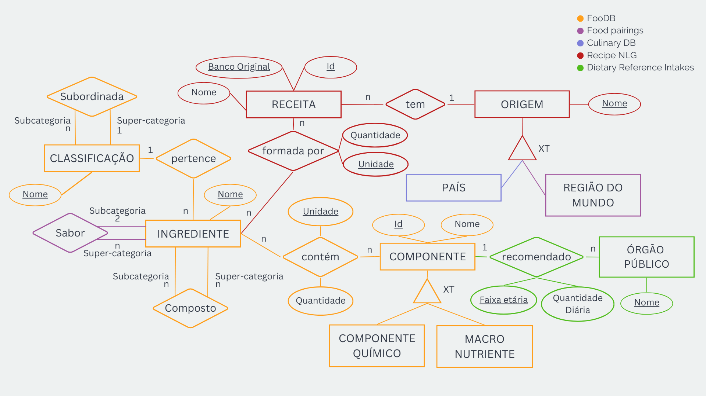
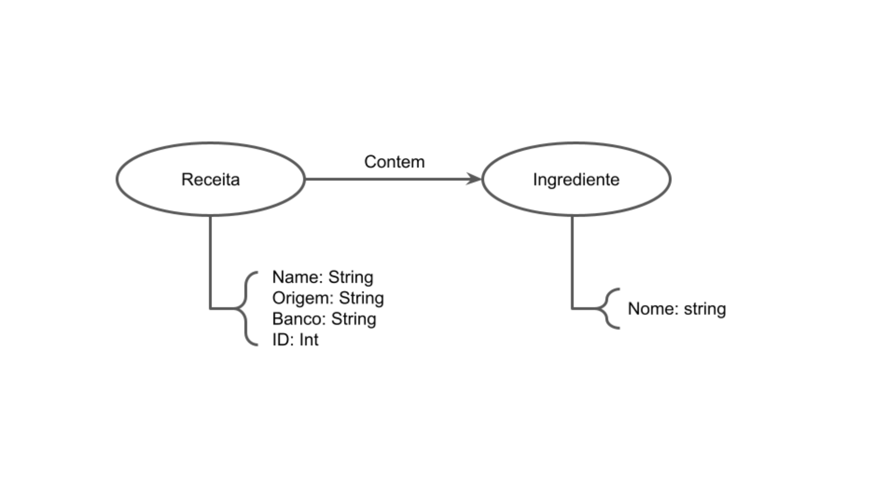

# Projeto 2 - Final

## Motivação e Contexto

> Lorem Ipsum

## Slides

### Apresentação Prévia
> [PDF](./slides/apresentacao_previa.pdf)

### Apresentação Final
> [PDF](./slides/apresentacao_final.pdf)

### Vídeo da apresentação

## Modelo Conceitual

## Modelos Lógicos

### Modelo Lógico Relacional

~~~
ORIGEM(_Nome_, Tipo)

RECEITA(_Id_, _BancoOriginal_, Nome, Origem)
	Origem chave estrangeira -> ORIGEM(Nome)

INGREDIENTE(_Nome_, Classificacao)
	Classificacao chave estrangeira -> CLASSIFICACAO(Nome)

INGREDIENTECOMPOSTO(_IngredienteComposto_, _IngredienteOriginal_)
	IngredienteComposto chave estrangeira -> INGREDIENTE(Nome)
	IngredienteOriginal chave estrangeira -> INGREDIENTE(Nome)

SABOR(_Id_, Ingrediente1, Ingrediente2, Quantidade)
	Ingrediente1 chave estrangeira -> INGREDIENTE(Nome)
	Ingrediente2 chave estrangeira -> INGREDIENTE(Nome)

CLASSIFICACAO(_Nome_, CategoriaSuperior)

COMPONENTE(_Id_, _Tipo_, Nome)

ORGAOPUBLICO(_Nome_)

INGREDIENTESDASRECEITAS(_IdReceita_, _Banco_, _Ingrediente_, _Unidade_, Quantidade)
	(IdReceita, Banco) chave estrangeira -> RECEITA(Id, BancoOriginal)  
    Ingrediente chave estrangeira -> INGREDIENTE(Nome)

COMPONENTESDOSINGREDIENTES(_Ingrediente_, _IdComponente_, _Tipo_, _Unidade_, Quantidade)
	Ingrediente chave estrangeira -> INGREDIENTE(Nome)
	(IdComponente, Tipo) chave estrangeira -> COMPONENTE(Id, Tipo)

RECOMENDACAO(_Orgao_, _IdComponente_, _Tipo_, _FaixaEtaria_, QuantidadeMg)
	Orgao chave estrangeira -> ORGAO(Nome)
	(IdComponente, Tipo) chave estrangeira -> COMPONENTE(Id, Tipo)
~~~

### Modelo Lógico de Grafos

## Dataset Publicado

título do arquivo/base | link | breve descrição
----- | ----- | -----
`<título do arquivo/base>` | `<link para arquivo/base>` | `<breve descrição do arquivo/base>`

## Bases de Dados
título da base | link | breve descrição
----- | ----- | -----
FooDB | [link](https://foodb.ca/) | Dados sobre alimentos, sua química, seus ingredientes e nutrientes.
Flavor network and the principles of food pairing | [link](https://doi.org/10.1038/srep00196) | Artigo que disponibiliza dados sobre diversos sabores, além de uma lista de receitas por região do mundo.
RecipeNLG | [link](https://recipenlg.cs.put.poznan.pl/) | Receitas e as devidas quantidades dos ingredientes utilizados em cada uma delas.
CulinaryDB | [link](https://cosylab.iiitd.edu.in/culinarydb/) | Dados de receitas e ingredientes associados a 22 regiões do mundo diferentes.
Nutrient Recommendations: Dietary Reference Intakes (DRI) | [link](https://ods.od.nih.gov/HealthInformation/nutrientrecommendations.aspx) | Recomendações diárias de consumo de diversos nutrientes, divididos por faixa etária.

## Detalhamento do Projeto
> Lorem Ipsum

## Evolução do Projeto
> Lorem Ipsum

## Perguntas de Pesquisa/Análise Combinadas e Respectivas Análises

### Perguntas/Análise com Resposta Implementada

#### Pergunta/Análise X
> * Lorem Ipsum
>   
>   * Lorem Ipsum

### Perguntas/Análise Propostas mas Não Implementadas

#### Pergunta/Análise X
> * Lorem Ipsum
>   
>   * Lorem Ipsum