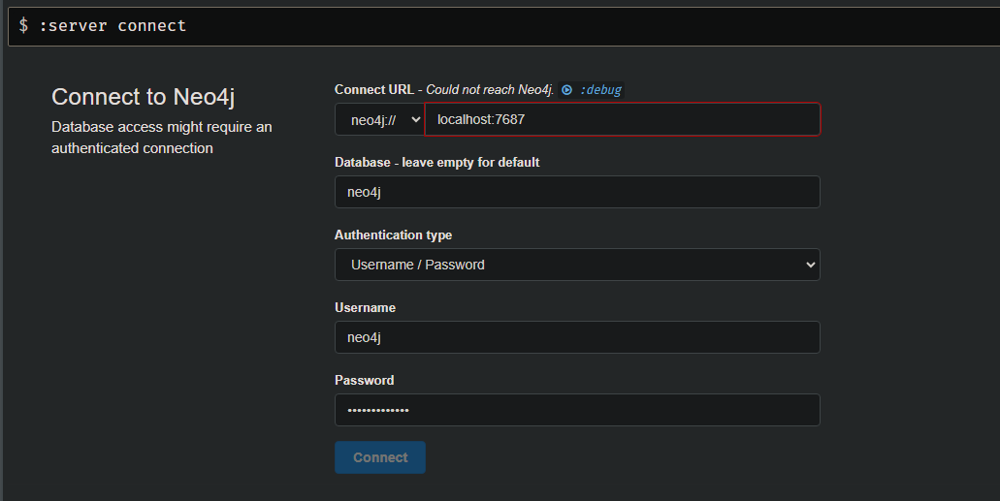

# Instalação do Ambiente do Neo4j

Para a instalação utilizaremos Docker, cheque como instalar Docker na sua distribuição do Linux ou para Windows https://docs.docker.com/engine/install/ .

## Rodando o ambiente do Neo4j

Para rodar o ambiente rode o seguinte comando no terminal

```
sudo docker run \
--restart always \
--publish=7474:7474 --publish=7687:7687 \
--env NEO4J_AUTH=neo4j/senhadodocker \
--env NEO4J_apoc_export_file_enabled=true \
--env NEO4J_apoc_import_file_enabled=true \
--env NEO4J_apoc_import_file_use__neo4j__config=true \
--env NEO4J_PLUGINS='["graph-data-science", "apoc"]' \
neo4j:5.14.0
```

## Entrando no ambiente

Agora com o ambiente funcionando, entre no seu navegador no endereço [localhost:7474](http://localhost:7474)

## Logando na database

Na sessão de login coloque os seguintes dados

.

E na senha coloque:

```senhadodocker```

# Montando o grafo

Rode as seguintes queries para montar o grafo

Carregue os nós Receita
```cypher
LOAD CSV WITH HEADERS FROM 'https://raw.githubusercontent.com/phdaccache/MC536-GPALT/main/project-2-final/data/processed/database/receita.csv' AS line
CREATE (:Receita {id: line.IDRECEITA, name: line.NOMERECEITA, banco: line.BANCOORIGINAL, origem: line.ORIGEM})
```
Apague os nós de tabelas que não são da CulinaryDB
```cypher
MATCH (n:Receita) WHERE n.banco <> 'CulinaryDB' DELETE n
```

Carregue os nós Ingrediente
```cypher
LOAD CSV WITH HEADERS FROM 'https://raw.githubusercontent.com/phdaccache/MC536-GPALT/main/project-2-final/data/processed/database/ingrediente.csv' AS line
CREATE (:Ingrediente {nome: line.NOME})
```
Crie os index
```cypher
CREATE INDEX receita_index FOR (n:Receita) ON (n.id)
```
```cypher
CREATE INDEX ingrediente_index FOR (n:Ingrediente) ON (n.nome)
```

Crie o relacionamento entre Receita e Ingrediente
```cypher
LOAD CSV WITH HEADERS FROM 'https://raw.githubusercontent.com/phdaccache/MC536-GPALT/main/project-2-final/data/processed/database/ingredientesdasreceitas.csv' AS line
MATCH (i:Ingrediente {nome: line.INGREDIENTE})
MATCH (r:Receita {id: line.ID})
CREATE (i)-[:Contem]->(r)
```

Gere a projeção de Ingredientes
```cypher
MATCH (i1:Ingrediente)-[a]->(r:Receita)<-[b]-(i2:Ingrediente)
WHERE r.origem = 'South America' AND i1 <> i2
MERGE (i1)<-[re:Relaciona]->(i2)
ON CREATE SET re.weight=1
ON MATCH SET re.weight=re.weight+1
```


# Pergunta 1
Para a pergunta 1 utilizaremos o grafo virtual a seguir (apague ele antes de rodar a pergunta 2)


```cypher
CALL gds.graph.project(
  'myGraph',
  'Ingrediente',
  {
    Relaciona: {
      orientation: 'REVERSE',
      properties: ['weight']
    }
  }
)
```

Gere a centralide dos nós Ingrediente
```cypher
CALL gds.degree.write('myGraph', { writeProperty: 'degree' })
YIELD centralityDistribution, nodePropertiesWritten
RETURN centralityDistribution.min AS minimumScore, centralityDistribution.mean AS meanScore, nodePropertiesWritten
```

# Pergunta 2
Para a pergunta 2 utilizaremos o grafo virtual a seguir (apague ele antes de rodar a pergunta 1)


```cypher
CALL gds.graph.project(
    'myGraph',
    'Ingrediente',
    {
        Relaciona: {
            orientation: 'UNDIRECTED'
        }
    },
    {
        relationshipProperties: 'weight'
    }
)
```

Gere a centralide dos nós Ingrediente
```cypher
CALL gds.louvain.stream('myGraph', { relationshipWeightProperty: 'weight' })
YIELD nodeId, communityId, intermediateCommunityIds
RETURN gds.util.asNode(nodeId).name AS name, communityId
ORDER BY name ASC
```
